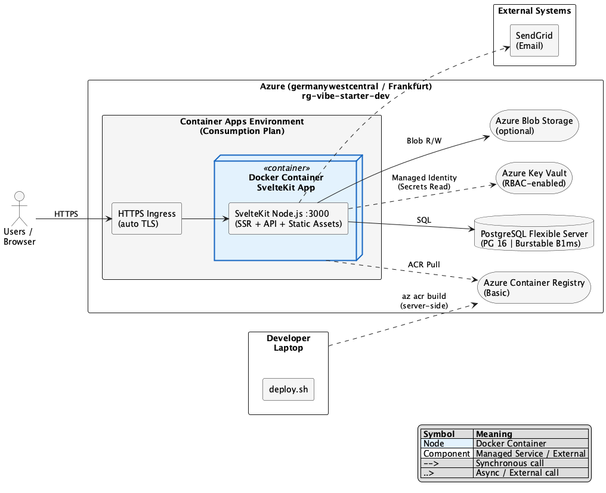

# Azure Managed Setup

Azure Container Apps deployment for SvelteKit Vibe Starter.

## Guides

- [Initial Resource Setup](./docs/01-initial-setup.md) — which scripts to run, in what order, what gets created
- [Local Development](./docs/02-local-development.md) — daily workflow with `dev-from-kv.sh`
- [Dev Deployment](./docs/03-dev-deployment.md) — building and deploying to Azure
- [Production Deployment](./docs/04-production-deployment.md) — anticipated production setup

## Architecture



_Source: [architecture.puml](./docs/architecture.puml)_

```
rg-vibe-starter-dev (germanywestcentral / Frankfurt)
├── vibe-starter-db-dev      PostgreSQL Flexible Server (Burstable B1ms, PG16)
│   └── vibe_starter         Database
├── vibe-starter-kv-dev      Key Vault (RBAC-enabled)
│   ├── database-url         Secret (auto-generated by setup-db.sh)
│   ├── better-auth-secret   Secret (auto-generated)
│   ├── github-client-*      Secrets (optional)
│   ├── sendgrid-*           Secrets (optional)
│   └── azure-openai-*       Secrets (optional)
├── vibestarteracrdev        Container Registry (Basic)
│   └── vibe-starter:latest  Docker image
├── vibe-starter-env-dev     Container Apps Environment (Consumption)
│   └── vibe-starter-app-dev Container App (Node.js, port 3000)
│       └── System MI → KV Secrets User + ACR Pull + Storage Blob Contributor
└── vibestarterstdev          Storage Account (optional)
    └── uploads              Blob container
```

SvelteKit with `adapter-node` is a single Node.js server (SSR + API + static assets). Only one Container App needed — no separate frontend deployment.

## Design Principles

- **Idempotent scripts** — every script can be run multiple times safely. Resources are checked before creation. Password rotation requires explicit `--rotate-password` flag.
- **Key Vault as single source of truth** — all secrets live in Key Vault. The Container App receives them as env vars via Key Vault secret references. Local dev fetches them via `dev-from-kv.sh`.
- **Managed Identity for auth** — no credentials stored on the Container App. RBAC roles grant access to KV, ACR, and Blob Storage.
- **Server-side Docker builds** — `deploy.sh` uses `az acr build` (builds on Azure, not locally). No local Docker daemon required.
- **Least privilege RBAC** — setup user gets temporary write access during setup, then downgraded to read-only.
- **Infrastructure-agnostic app** — the SvelteKit app reads secrets from `process.env` via a centralized config module (`$lib/server/config.ts`). It has zero awareness of Azure, KV, or any cloud provider. The infrastructure layer (these scripts) injects secrets as env vars.

## Credential Security

**Threat model:** Coding agents run scripts and see all terminal output. Credentials must never be exposed.

### Rules

| Rule                                         | How                                                                                                                          |
| -------------------------------------------- | ---------------------------------------------------------------------------------------------------------------------------- |
| No credentials in terminal output            | Scripts never `echo` passwords, tokens, connection strings, or API keys                                                      |
| No credentials on local filesystem           | No `.env` files with production secrets. All secrets go directly to Key Vault                                                |
| No interactive prompts for essential secrets | `DATABASE_URL` and `BETTER_AUTH_SECRET` are auto-generated and stored in KV. Only optional keys use interactive prompts      |
| Variables unset after use                    | `unset ADMIN_PASSWORD DATABASE_URL` after storing in KV                                                                      |
| No password rotation on re-run               | `setup-db.sh` skips password changes when server + KV secret already exist. Use `--rotate-password` for intentional rotation |
| overview.sh never shows secret values        | Only lists secret names, never retrieves values                                                                              |

### What agents CAN see

- Resource names, hostnames, FQDNs
- Azure resource IDs and subscription info
- Status messages ("Key Vault created", "Credentials stored in Key Vault")
- Container App URL
- Secret _names_ (not values)

### What agents will NEVER see

- Database passwords or `DATABASE_URL`
- `BETTER_AUTH_SECRET`
- `SENDGRID_API_KEY`
- Any Key Vault secret values

### App Config Module

The app centralizes all env var access in `src/lib/server/config.ts`:

- Declares all required and optional env vars with types
- Validates required vars eagerly at server startup (fail fast)
- All server modules import from `config` instead of `$env/dynamic/private` directly
- 100% infrastructure-agnostic — works with any platform that injects env vars
